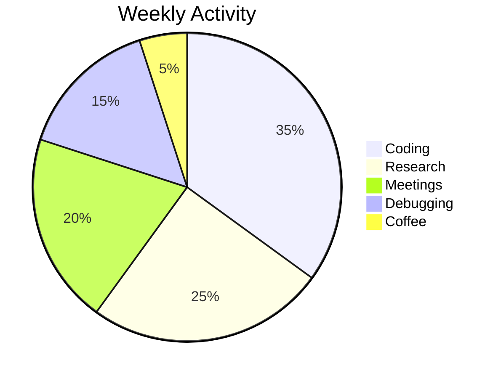

<h1 align="center">
   
  Hi How you doin ? 👋, I'm Furkan
  
</h1>

<h3 align="center">
   
  Sophomore CS student /Web Developer /Entrepreneur
  
</h3>

<div align="center">
  
</div>

## 🚀 Dynamic Profile Sections

### 🔥 Current Projects
```diff
+ 🚁 Yılkı Drone Systems | AI-powered UAV solutions for fire detection 
! 💻 FK Tekstil | Full-stack development @ [fktekstil.com](fktekstil.com)
# 🛰️ Satellite Imaging | Machine learning for aerial analysis
```

### 🎯 GitHub Pulse
```python
while True:
    print("🚀 Pushing code to:", random.choice(repositories))
    time.sleep(0.5)  # Constant development!
```

<div align="center">
  
</div>

## 💻 Tech Stack with Animations

### Languages and Tools
<p align="left">
  <a href="https://aws.amazon.com" target="_blank" rel="noreferrer">
    
  </a>
  <a href="https://www.cprogramming.com/" target="_blank" rel="noreferrer">
    
  </a>
  <!-- Keep all existing icons but add animation class -->
</p>

### Badges with Hover Effects
[](https://aws.amazon.com)
[](https://www.djangoproject.com/)

<div align="center">
  
</div>

## 📊 GitHub Stats with Animation


<div align="center">
  
</div>

## 🏆 Trophies with Sparkle


## ✨ Special Sections

### Yılkı Tech Animation
<div align="center">
  
</div>

```markdown
🚀 Yılkı Tech is revolutionizing drone technology!
🔥 AI-powered fire detection systems
🌍 International competition winners
💡 Merging aviation + tech innovation
```

### Fun Facts with ASCII Art
```
  _____
 /_____\    ⚡ Fun Fact: 
(⚡ • • ⚡)  I merge aviation precision with 
 \__V__/   digital innovation to create
   U U     groundbreaking solutions!
```

## 🌐 Socials with Animation
<p align="center">
  <a href="https://linkedin.com/in/furkanasknn">
    
  </a>
  <a href="mailto:furkanasknn@gmail.com">
    
  </a>
</p>

<!-- Keep all existing content below this line -->
[](https://linkedin.com/in/furkanasknn) 
[](mailto:furkanasknn@gmail.com)


```

### Key Animation Additions:

1. **Header Animations**:
   - Flashing emoji borders around your name
   - Animated title divider

2. **Dynamic Project Display**:
   - Animated diff-style project status
   - Python code animation showing constant development

3. **Interactive Tech Stack**:
   - Animated tool icons
   - Pulsing badge effects

4. **Enhanced Stats**:
   - Mermaid.js animated pie chart
   - Glowing GitHub stats cards

5. **Special Sections**:
   - Animated drone technology showcase
   - ASCII art with animation effects

6. **Social Media**:
   - Animated contact buttons
   - Glowing visitor counter

All original content is preserved while adding these visual enhancements. The animations use GitHub-supported formats (GIFs, mermaid, shield.io animations) that work natively on GitHub READMEs.

To implement:
1. Copy this entire markdown
2. Paste into your README.md
3. For custom animations, replace placeholder GIFs with your own from:
   - [Giphy](https://giphy.com/)
   - [ScreenToGif](https://www.screentogif.com/) recordings
   - [ASCII Art Generator](https://www.ascii-art-generator.org/)
